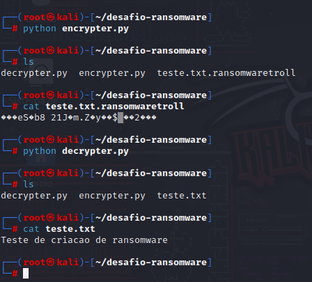

# cibersecurity-desafio-ransomware
Ransomware para criptografar arquivos utilizando Python

## Ferramentas
- Kali Linux
- Python

## Passos para criar o ransomware
- Acesso root:sudo su
- vi encrypter.py
- vi decrypter.py
- vi teste.txt
- Método de ataque: Ransomware, criptografar arquivos via pythoon

## Resutados

